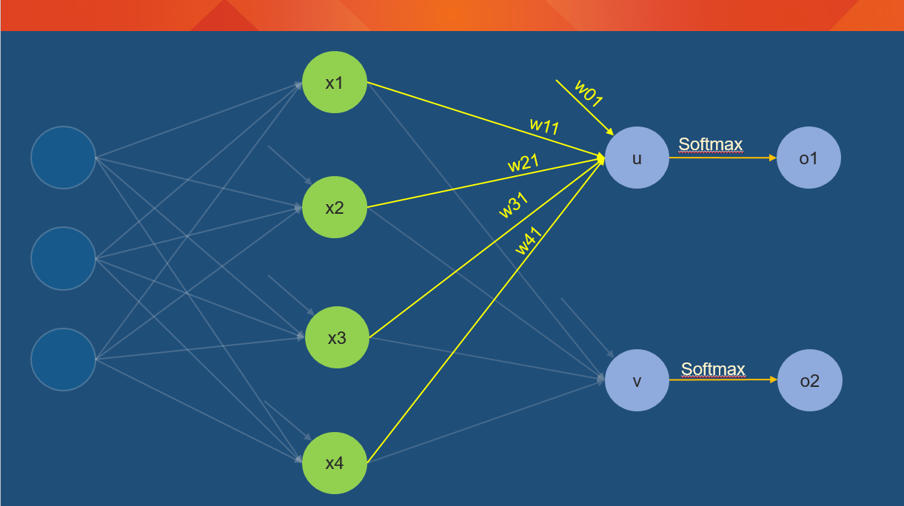

## Exploring the example given in the AI-WorkShop by James McCaffrey.

### Sample Feed Forward Neural Network

#### Part 1: 
Goal here is to find the change in weights to reduce the output error. In the first section, we will look at how the weights to the output layer can be modified based on the output values and the error rate. 

I have added one more node to explicitly show the Softmax operations as it is easier to show calculations.

1) Lets look at the output from the last hidden layer:
    $$u = (x_{0}*w_{01}) + (x_{1}*w_{11}) + (x_{2}*w_{21}) + (x_{3}*w_{31}) + (x_{4}*w_{41})$$

2) Now, lets apply the softmax function to the output $u$ to get the output $o_{1}$
    $$o_{1} = \frac{e^{u}}{e^u + e^v}$$
    
    Similarlty, if we assume the output from the 2nd output node is $v$ then we have:
    $$o_{2} = \frac{e^{v}}{e^u + e^v}$$

    
3) As James showed, the error is specified as:
    $$E = \frac{1}{2} * \sum_{j = 1}^2 (t_{j} - o_{j})^{2}$$
    

4) Now, our goal is to calculate the change in weight that can reduce the error e.g if we consider $w_{11}$ as the 
  weight under consideration we want to calculate: $\frac{\partial E}{\partial w_{11}}$

5) For calculating this, we use the chain rule:
  
  $$ \frac{\partial E}{\partial W_{11}} = \frac{\partial E}{\partial o_{1}}* \frac{\partial o_{1}}{\partial u} *  \frac{\partial u}{\partial W_{11}} $$

6) Now lets calculate:$\frac{\partial E}{\partial o_{1}}$:
    
    $\frac{\partial E}{\partial o_{1}}  = 2*\frac{1}{2}* (t_{1}-o_{1}) * \frac{\partial {(t_{1}-o_{1})}}{\partial o_{1}}$
          
    $\frac{\partial E}{\partial o_{1}}  =  -1 * (t_{1}-o_{1})$
        
    $\frac{\partial E}{\partial o_{1}}  =  (o_{1}-t_{1})$ 
  
  
7) Next we have to calculate: $\frac{\partial o_{1}}{\partial u}$
    
    Remember $o_{1} = \frac{e^{u}}{e^u + e^v}$
    
    $\frac{\partial o_{1}}{\partial u} = \frac{\partial {\frac{e^{u}}{e^u + e^v} }}{\partial u}$
    
    $\frac{\partial o_{1}}{\partial u} = \frac{(e^u + e^v)*e^u - e^u*e^u}{(e^u+e^v)^2}$
    
    $\frac{\partial o_{1}}{\partial u} = \frac{e^u * e^v}{(e^u + e^v)^2}$
    
    $\frac{\partial o_{1}}{\partial u} = \frac{e^u}{e^u + e^v} * \frac{e^v}{e^u + e^v}`$
    
    $\frac{\partial o_{1}}{\partial u} = \frac{e^u}{e^u + e^v} * (1 - \frac{e^u}{e^u + e^v} )$
    
    $\frac{\partial o_{1}}{\partial o_1} = o_1 * (1- o_1)$

8) Lastly, we calculate: $\frac{\partial u}{\partial w_{11}}$ 
    
    Remember
      $u = (x_{0}*w_{01}) + (x_{1}*w_{11}) + (x_{2}*w_{21}) + (x_{3}*w_{31}) + (x_{4}*w_{41})$
    
    
    $\frac{\partial u}{\partial w_{11}} = \frac{\partial (x_{0}*w_{01}) + (x_{1}*w_{11}) + (x_{2}*w_{21}) + (x_{3}*w_{31}) + (x_{4}*w_{41})  }{\partial w_{11}}$
    
    $\frac{\partial u}{\partial w_{11}} = x_1$

9) Now combining equations from (5),(6),(7) and (8):

    $\frac{\partial E}{\partial w_{11}} = \frac{\partial E}{\partial o_{1}}* \frac{\partial o_{1}}{\partial u}* \frac{\partial u}{\partial w_{11}}$
    
    
    $\frac{\partial E}{\partial w_{11}} = (o_{1}-t_{1}) * o_1 * (1- o_1) * x_1$
      
    Rearranging terms:   
      
    $\frac{\partial E}{\partial w_{11}} = x_1 * (o_{1}-t_{1}) * o_1 * (1- o_1)$
  
10) And similarly we can calculate the change in Error based on another weight
    
    $\frac{\partial E}{\partial w_{21}}$ = $x_2 * (o_{1}-t_{1})$ $*$ $o_1 * (1- o_1)$
    
    or in general:
    
    $\frac{\partial E}{\partial w_{ij}}$ = $x_i * (o_{j}-t_{j})$ $*$ $o_j * (1- o_j)$
    

11) We can now use this error to update the weights:

    $w_{ij} = w_{ij} + \alpha * \frac{\partial E}{\partial w_{ij}}$

    where $\alpha$ is the learning rate

#### Part 2: 
Goal  for Part 2 is to find the change in weights in the hidden layer to reduce the output error. We will follow the backpropgation algorithm that James showed in the class.

